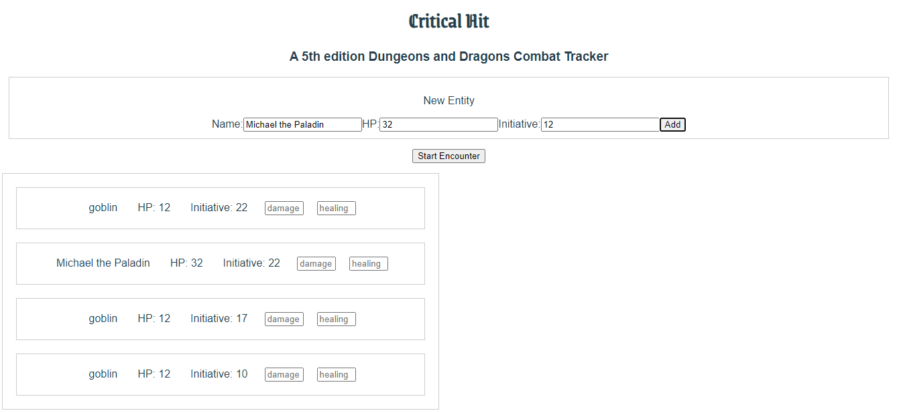
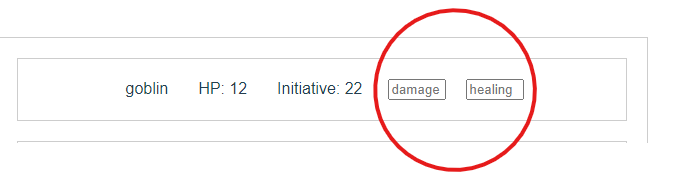

# Critical Hit

This was made in my time as a student at Code Chrysalis.

# A Dungeons and Dragons 5th Edition Combat Tracker

This web application is intended for any Dungeon Master (DM) who needs a simple tool to keep track of players and monsters in combat.

---

## How to Use

Add some monster or player characters by using the input fields at the top of the page. Input the name, max/current HP and the entity's initiative modifier — the app will automatically roll a d20 and add the roll to each entity to create their initiative.

The app will automatically sort all entities by initiative, so that the first turn in combat goes to the creature at the top of the list, and subsequent turns follow the list in order.

## Dealing Damage and Healing to Entities

Use the damage input boxes next to each entity to subtract from their current HP. Enter a number and press Enter or click outside the input field to apply damage/healing.

A note on Healing: the healing input box can force an entity to go OVER it's max HP, so the DM must keep track of max HP manually. This is intended to be fixed in a future release.

When an entity is at 0 HP or negative HP, the DM can ignore them in combat or apply their own preferred rules for a custom experience — Critical Hit will not tell you what to do!

---

# After an Encounter

To reset everything, simply refresh the page in your browser

# Future Releases

Intended features to be included in future releases of Critical Hit:

- Removing single entities from encounter
- Ability to load preset monsters from a database into encounter
- Allowing users to save custom monsters into database for future use
- Conditional highlighting of entities to indicate current turn
- Next Turn button to move combat forward